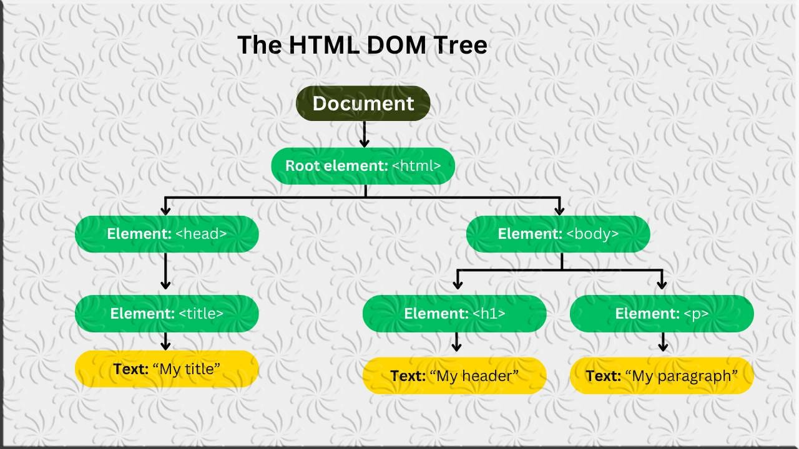

# **Understanding the Document Object Model (DOM) in JavaScript**

## Welcome to the Browser!

Everything we've written so far has lived in `.js` files and printed to the console. That's essential for understanding JavaScript — but the real reason most people learn JS is to **build interactive web pages**.

This lesson is where JavaScript meets HTML. Here's where things start looking real.

---

## **Introduction**

The **Document Object Model (DOM)** is a programming interface for web documents. It represents the page so that programs can change the document structure, style, and content. The DOM provides a structured representation of the document as a tree of objects that can be manipulated using JavaScript.



## **What is the DOM?**

- **Document**: Refers to the HTML document loaded in the browser.
- **Object**: Each element in the document is represented as an object.
- **Model**: These objects are arranged in a tree-like structure.

The DOM is created by the browser when a web page is loaded. It is a dynamic, object-oriented representation of the HTML or XML document. Through the DOM, JavaScript can access and manipulate HTML elements and their attributes, styles, and contents.

## **DOM Tree Structure**

The DOM represents a document as a tree structure with nodes. Each node is an object representing a part of the document. The different types of nodes include:

1. **Document Node**: The top-most node representing the entire document.
2. **Element Nodes**: Represent HTML tags (e.g., `<div>`, `<p>`, `<h1>`).
3. **Text Nodes**: Represent the text content within elements.
4. **Attribute Nodes**: Represent attributes of HTML elements (e.g., `class`, `id`).
5. **Comment Nodes**: Represent comments within the HTML.

### **Example of a Simple DOM Tree:**

Consider the following HTML:
```html
<!DOCTYPE html>
<html>
  <head>
    <title>Example Page</title>
  </head>
  <body>
    <h1>Hello, World!</h1>
    <p>This is a simple paragraph.</p>
  </body>
</html>
```

The DOM tree for this HTML document would look like this:

```
Document
 └── html
     ├── head
     │   └── title
     │       └── "Example Page"
     └── body
         ├── h1
         │   └── "Hello, World!"
         └── p
             └── "This is a simple paragraph."
```

## **Accessing the DOM**

JavaScript provides various methods to access and manipulate elements in the DOM. Here are some of the most commonly used methods:

### **1. Accessing Elements by ID**

- **`document.getElementById()`**: Returns the element with the specified `id` attribute.

  ```javascript
  const header = document.getElementById("header");
  ```

### **2. Accessing Elements by Class Name**

- **`document.getElementsByClassName()`**: Returns an HTMLCollection of elements with the specified class name.

  ```javascript
  const items = document.getElementsByClassName("item");
  ```

### **3. Accessing Elements by Tag Name**

- **`document.getElementsByTagName()`**: Returns an HTMLCollection of elements with the specified tag name.

  ```javascript
  const paragraphs = document.getElementsByTagName("p");
  ```

### **4. Accessing Elements Using Query Selectors**

- **`document.querySelector()`**: Returns the first element that matches a specified CSS selector.
  
  ```javascript
  const mainHeader = document.querySelector("h1");
  ```

- **`document.querySelectorAll()`**: Returns a NodeList of all elements that match a specified CSS selector.

  ```javascript
  const allHeaders = document.querySelectorAll("h1");
  ```

## **Manipulating the DOM**

Once you have accessed the DOM elements, you can manipulate them by changing their attributes, content, or styles.

### **1. Changing HTML Content**

- **`innerHTML`**: Sets or returns the HTML content of an element.

  ```javascript
  document.getElementById("demo").innerHTML = "Hello, World!";
  ```

- **`textContent`**: Sets or returns the text content of an element.

  ```javascript
  document.getElementById("demo").textContent = "Hello, World!";
  ```

### **2. Changing Attributes**

- **`setAttribute()`**: Sets the value of an attribute on an element.

  ```javascript
  document.getElementById("myImage").setAttribute("src", "image.png");
  ```

- **`getAttribute()`**: Returns the value of an attribute on an element.

  ```javascript
  const srcValue = document.getElementById("myImage").getAttribute("src");
  ```

- **`removeAttribute()`**: Removes an attribute from an element.

  ```javascript
  document.getElementById("myImage").removeAttribute("src");
  ```

### **3. Changing Styles**

- **`style` property**: Allows you to change the style of an element directly.

  ```javascript
  document.getElementById("header").style.color = "blue";
  document.getElementById("header").style.fontSize = "24px";
  ```

### **4. Adding and Removing Classes**

- **`classList.add()`**: Adds a class to the element.

  ```javascript
  document.getElementById("myDiv").classList.add("new-class");
  ```

- **`classList.remove()`**: Removes a class from the element.

  ```javascript
  document.getElementById("myDiv").classList.remove("new-class");
  ```

- **`classList.toggle()`**: Toggles a class on the element.

  ```javascript
  document.getElementById("myDiv").classList.toggle("active");
  ```

### **5. Adding and Removing Elements**

- **`createElement()`**: Creates a new element.

  ```javascript
  const newParagraph = document.createElement("p");
  newParagraph.textContent = "This is a new paragraph.";
  ```

- **`appendChild()`**: Appends an element as the last child of another element.

  ```javascript
  document.body.appendChild(newParagraph);
  ```

- **`removeChild()`**: Removes a child element.

  ```javascript
  const parentElement = document.getElementById("parent");
  const childElement = document.getElementById("child");
  parentElement.removeChild(childElement);
  ```

  ---

## Key Takeaways

| Task | Code |
|------|------|
| Select one element | `document.querySelector("selector")` |
| Select many elements | `document.querySelectorAll("selector")` |
| Read text | `element.textContent` |
| Change text | `element.textContent = "new text"` |
| Change HTML | `element.innerHTML = "<b>bold</b>"` |
| Change style | `element.style.property = "value"` |
| Add class | `element.classList.add("class")` |
| Remove class | `element.classList.remove("class")` |
| Toggle class | `element.classList.toggle("class")` |
| Create element | `document.createElement("tag")` |
| Append to page | `parent.appendChild(child)` |
| Remove element | `element.remove()` |

---

## What's Next?

You can now select and change elements. The next lesson teaches **events** — how to make your page *react* when users click, type, hover, and interact.