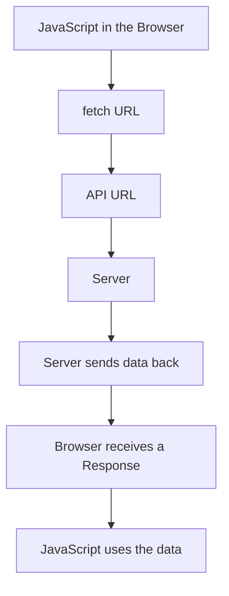
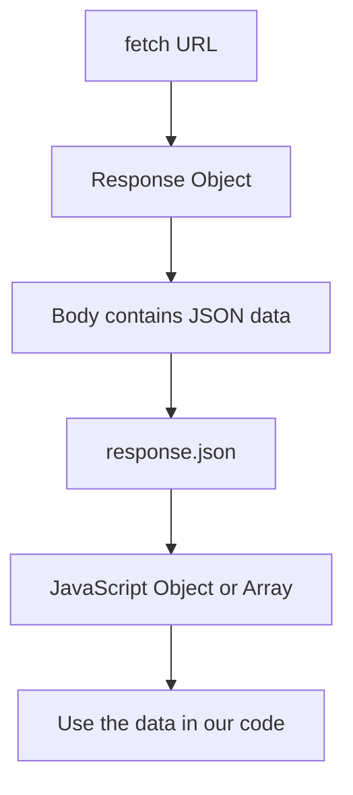

# Lesson 06 — Fetch API 🌐

> In this lesson, we will learn how JavaScript gets data from the internet using `fetch()`.

---

## What Are We Actually Doing?

Most apps do not keep all their data inside the app.

For example:

* Instagram loads posts from a server.
* A weather app loads weather data from a server.
* A shopping app loads products from a server.

Your JavaScript can ask a server for data.

The server sends the data back.

Then JavaScript can show that data on the page.

The tool we use for this is called:

```js
fetch()
```

---

## What is an API?

An **API** is a URL that gives data to your application.

Simple definition:

> An API is a URL we can request data from.

Example:

```txt
https://jsonplaceholder.typicode.com/users
```

This API gives us a list of users.

When we visit this URL, the server sends data back.

That data usually comes back as **JSON**.

---

## What is Fetch?

`fetch()` is a JavaScript function used to request data from an API or server.

Simple definition:

> Fetch is a JavaScript function used to get data from the internet.

Example:

```js
fetch("https://jsonplaceholder.typicode.com/users");
```

You can read this as:

> Go to this URL and get the users.

---

## Graph 1 — How Fetch Gets Data from a Server



### Simple Explanation

1. JavaScript calls `fetch()`.
2. `fetch()` sends a request to the API.
3. The server receives the request.
4. The server sends data back.
5. JavaScript receives the response.
6. JavaScript can use the data.

---

## What is HTTPS?

Most API URLs start with:

```txt
https://
```

Example:

```txt
https://jsonplaceholder.typicode.com/users
```

`HTTPS` means the browser is communicating with the server in a secure way.

Simple definition:

> HTTPS is the secure way your browser talks to a website or API.

When we use `fetch()` with an HTTPS URL, JavaScript sends a request to that secure URL and waits for the server to send data back.

You do not need to understand all the technical details right now. Just remember:

```txt
https:// = secure website or secure API URL
```

---

## What are Status Codes?

When JavaScript sends a request to a server, the server sends back a response.

That response includes a number called a **status code**.

A status code tells us what happened to the request.

Example:

```js
const response = await fetch("https://jsonplaceholder.typicode.com/users");

console.log(response.status);
console.log(response.ok);
```

If the request works, you may see:

```txt
200
true
```

### Common Status Codes

| Status Code | Meaning                                           |
| ----------- | ------------------------------------------------- |
| 200         | Success. The request worked.                      |
| 201         | Created. New data was created.                    |
| 400         | Bad request. Something is wrong with the request. |
| 401         | Unauthorized. You are not logged in.              |
| 403         | Forbidden. You are not allowed.                   |
| 404         | Not found. The URL or data does not exist.        |
| 500         | Server error. Something broke on the server.      |

For this beginner lesson, focus on these two:

```txt
200 = success

404 = not found
```

---

## Checking the Response

The response object has useful information.

```js
async function getUsers() {
  const response = await fetch("https://jsonplaceholder.typicode.com/users");

  console.log(response.status);
  console.log(response.ok);

  const users = await response.json();

  console.log(users);
}

getUsers();
```

### What does response.status mean?

```js
response.status
```

This gives the status code.

Example:

```txt
200
```

### What does response.ok mean?

```js
response.ok
```

This gives `true` or `false`.

It is:

```txt
true
```

when the request is successful.

It is:

```txt
false
```

when the server responds with an error status like `404` or `500`.

---

## Simple Summary

```txt
HTTPS = secure API URL

Status code = server's answer number

200 = success

404 = not found

response.status = the number

response.ok = true or false
```


## The Practice API

In this lesson, we will use a free practice API:

```txt
https://jsonplaceholder.typicode.com
```

To get users, we use:

```txt
https://jsonplaceholder.typicode.com/users
```

Try opening this URL in your browser.

You will see JSON data.

---

## Basic Fetch Example

```js
async function getUsers() {
  const response = await fetch("https://jsonplaceholder.typicode.com/users");

  const users = await response.json();

  console.log(users);
}

getUsers();
```

---

## What Happens in This Code?

### Step 1

```js
const response = await fetch("https://jsonplaceholder.typicode.com/users");
```

This sends a request to the API.

But it does not give us the final data yet.

It gives us a **Response object**.

The Response object is like a box.

The data is inside the box.

---

### Step 2

```js
const users = await response.json();
```

This opens the box and gets the JSON data inside it.

It also changes the JSON into a JavaScript object or array.

---

### Step 3

```js
console.log(users);
```

This prints the users in the console.

---

## What is a Response Object?

When we use `fetch()`, we first get a Response object.

The Response object contains information like:

* the body
* the status
* headers
* the URL

But the actual data is inside the body.

That is why we need:

```js
response.json()
```

---

## Why Do We Use response.json()?

Because `fetch()` gives us a Response object first.

The actual JSON data is inside the body of that Response.

`response.json()` reads the body and gives us usable JavaScript data.

---

## Graph 2 — How response.json() Works



### Simple Explanation

```txt
fetch()
↓
Response object
↓
response.json()
↓
JavaScript object or array
```

---

## Important Note

This is wrong:

```js
const response = await fetch(url);

console.log(response);
```

This only shows the Response object.

It does not show the final data.

---

This is correct:

```js
const response = await fetch(url);

const data = await response.json();

console.log(data);
```

Now we get the real data.

---

## Showing Users on the Page

### HTML

```html
<h1>Users</h1>

<ul id="userList"></ul>
```

### JavaScript

```js
async function showUsers() {
  const userList = document.querySelector("#userList");

  const response = await fetch("https://jsonplaceholder.typicode.com/users");

  const users = await response.json();

  userList.innerHTML = users
    .map((user) => {
      return `<li>${user.name} - ${user.email}</li>`;
    })
    .join("");
}

showUsers();
```

---

## How This Works

```js
const userList = document.querySelector("#userList");
```

This selects the `ul` from the HTML.

---

```js
const response = await fetch("https://jsonplaceholder.typicode.com/users");
```

This gets the Response object from the API.

---

```js
const users = await response.json();
```

This gets the real users data.

---

```js
userList.innerHTML = users
  .map((user) => {
    return `<li>${user.name} - ${user.email}</li>`;
  })
  .join("");
```

This creates an `li` for every user and puts it inside the page.

---

## Simple Error Handling

Sometimes the internet may fail.

The API may not work.

The URL may be wrong.

So we can use `try/catch`.

```js
async function showUsers() {
  const userList = document.querySelector("#userList");

  try {
    const response = await fetch("https://jsonplaceholder.typicode.com/users");

    const users = await response.json();

    userList.innerHTML = users
      .map((user) => {
        return `<li>${user.name} - ${user.email}</li>`;
      })
      .join("");
  } catch (error) {
    userList.innerHTML = "<li>Failed to load users.</li>";

    console.log(error);
  }
}

showUsers();
```

---

## What is try/catch Doing?

```js
try {
  // try this code
} catch (error) {
  // if something goes wrong, run this
}
```

Simple meaning:

> Try to load the users.
> If it fails, show an error message.

---

## Common Beginner Mistakes

### Mistake 1 — Forgetting response.json()

Wrong:

```js
const response = await fetch(url);

console.log(response);
```

This gives the Response object, not the real data.

Correct:

```js
const response = await fetch(url);

const data = await response.json();

console.log(data);
```

---

### Mistake 2 — Forgetting await before response.json()

Wrong:

```js
const data = response.json();

console.log(data);
```

This gives a Promise, not the final data.

Correct:

```js
const data = await response.json();

console.log(data);
```

---

### Mistake 3 — Not Calling the Function

Wrong:

```js
async function getUsers() {
  const response = await fetch(url);
  const users = await response.json();
  console.log(users);
}
```

The function exists, but it does not run.

Correct:

```js
getUsers();
```

---

## Key Takeaways

| Concept               | Meaning                                  |
| --------------------- | ---------------------------------------- |
| API                   | A URL that gives data                    |
| fetch()               | Gets data from an API                    |
| fetch returns         | A Promise                                |
| await fetch()         | Waits for the Response object            |
| response.json()       | Reads the body and gives JavaScript data |
| await response.json() | Waits for the final data                 |
| try/catch             | Handles errors                           |

---

## Final Simple Summary

```txt
API = URL that gives data

fetch() = ask the API for data

response = the box from the server

response.json() = open the box and get the data

data = JavaScript object or array
```

---

## Practice Challenge

Create a page that shows users from this API:

```txt
https://jsonplaceholder.typicode.com/users
```

Your page should show:

* user name
* user email
* user city

Hint:

```js
user.address.city
```

---

## What’s Next?

Next lesson:

### OOP in JavaScript

We will learn how to organize code using objects and classes.
